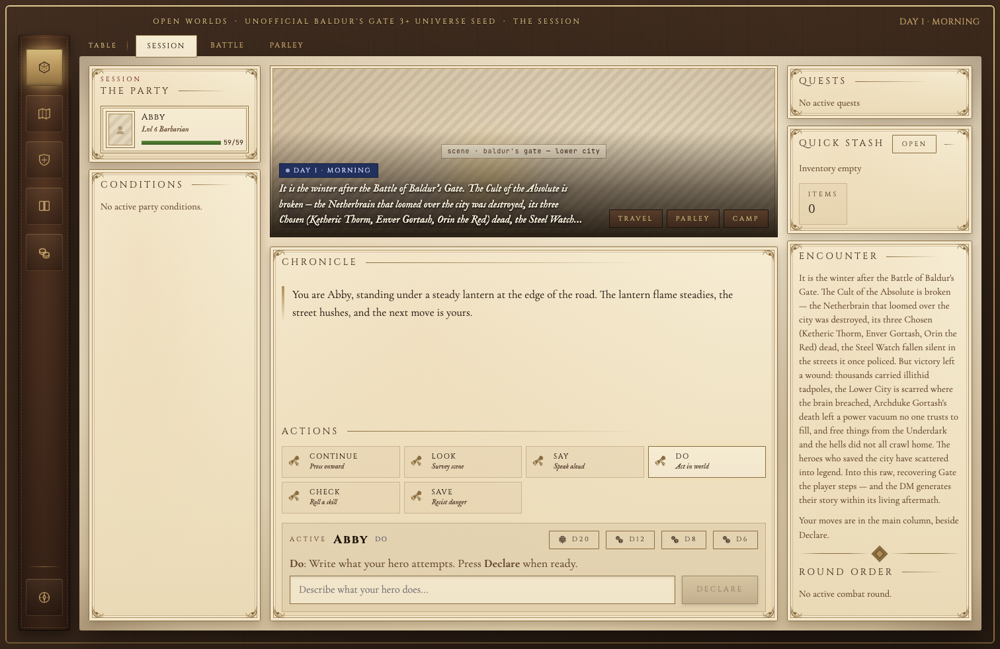
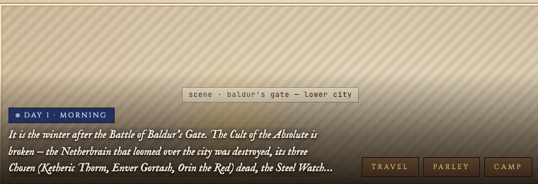
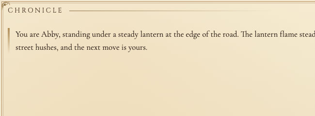
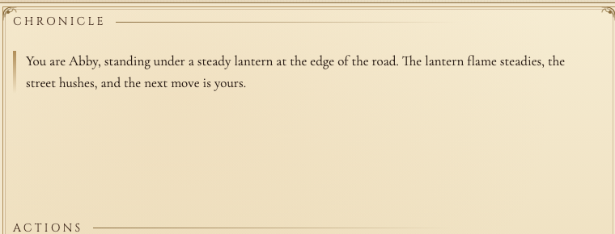

# WorldOS

**A playable living-world RPG engine and OpenWorlds app for tabletop-scale D&D 5e adventures.**

WorldOS turns a persistent world into a playable campaign: an AI Dungeon Master narrates the scene, the deterministic SRD 5.2 engine resolves rolls and state, and OpenWorlds gives the player a real app surface for actions, maps, party state, journals, and live narration. The provider is configurable: use Anthropic through Claude Code, Codex/OpenAI through Codex CLI, or future OpenClaw lanes without changing the engine contract.

> **Agents/contributors:** start at [`docs/OPERATIONS.md`](docs/OPERATIONS.md) — the one-page bootstrap (vision → roadmap → active sprint → the loop). The product vision lives in [`VISION.md`](VISION.md); the sequencing source of truth is [`docs/roadmap/PRODUCT-ROADMAP.md`](docs/roadmap/PRODUCT-ROADMAP.md).



| Scene | Chronicle | Actions |
|---|---|---|
|  |  |  |

Screenshots above are public-safe scripted demo captures with private art disabled. See [docs/images/README.md](docs/images/README.md).

## What WorldOS Does

- **Plays a real campaign:** start or resume a persistent living-world session with an AI DM and a player-facing action palette.
- **Keeps rules deterministic:** dice, checks, combat, spellcasting, inventory, rests, XP, and state writes live in the engine, not in model prose.
- **Keeps the app thin:** OpenWorlds and `WorldOS.app` read live engine state and submit `/move` intents; the engine remains the only campaign-state writer.
- **Supports provider lanes:** Anthropic/Claude Code and Codex/OpenAI are first-class provider families; OpenClaw is experimental/future-facing.
- **Ships public and private content paths:** original/redistributable content can be committed; user-owned or private worlds/art stay in ignored `_private/` folders.
- **Exports evidence:** app-status snapshots, session surfaces, screenshots, logs, moves, and provider traces can be bundled for QA without committing raw evidence.

## Choose Your Provider

| Provider family | Typical use | Default model lane | Notes |
|---|---|---|---|
| Claude Code / Anthropic | Anthropic-only users, Opus release comparisons, Claude plugin workflows | Opus DM, Sonnet player/scorer where selected | Does not require Codex CLI. |
| Codex CLI / OpenAI | Codex/OpenAI-only users, same-family GPT proof, local provider QA | GPT-5.5 DM/player/scorer unless configured | Does not require Claude login. |
| OpenClaw | Experimental gateway/provider research | Not the default release lane | Keep gateway/plugin work gated until native provider lanes prove parity. |

Provider parity means each family can configure, launch, play, test, and score through its own lane. It does **not** mean every model receives identical story/mechanical scores.

Read [docs/PROVIDERS.md](docs/PROVIDERS.md) for setup, model selection, command overrides, and troubleshooting.

## Quick Start

### 1. Clone and install runtime deps

```bash
git clone https://github.com/electricsheephq/WorldOS.git
cd WorldOS
curl -LsSf https://astral.sh/uv/install.sh | sh
```

You also need at least one provider login:

- Claude Code for the Anthropic lane.
- Codex CLI for the Codex/OpenAI lane.

### 2. Play in OpenWorlds

```bash
./worldos-play.command
```

or launch a specific world from a terminal:

```bash
scripts/play.sh sundered-reach
```

OpenWorlds serves at `http://127.0.0.1:8765/openworlds/`. The player acts through **Continue**, **Look**, **Say**, **Do**, skill/save buttons, travel, and combat actions. The selected provider resolves moves through the engine and writes the next narration beat.

### 3. Build and run the native app

```bash
script/build_and_run.sh
```

This builds `dist/WorldOS.app` from the Swift package under `macos/WorldOSApp/` and opens the native OpenWorlds shell.

### 4. Configure providers

Use the native app provider/settings screens or wrapper environment variables to select a provider family and model. The code keeps modern `WORLDOS_*` names and legacy `WORLDOS_*` aliases additive for compatibility.

See:

- [docs/GETTING_STARTED.md](docs/GETTING_STARTED.md)
- [docs/PROVIDERS.md](docs/PROVIDERS.md)
- [docs/TROUBLESHOOTING.md](docs/TROUBLESHOOTING.md)

## How QA Works

WorldOS separates quick app confidence from release proof:

- **Fast web checks:** use localhost/OpenWorlds plus `/app-status` and `/session-surface`.
- **Built-app handoff gate:** proves `dist/WorldOS.app` can launch, load art, seat a player, expose actions, accept `/move`, and produce provider narration.
- **Provider-specific proof:** Anthropic and Codex lanes can be tested independently; mixed-provider benchmarks must be labeled as benchmarks.
- **Release Readiness Index:** final release proof still requires a complete non-partial five-persona RRI on one build SHA.

Read:

- [docs/QA.md](docs/QA.md)
- [docs/APP_TESTING.md](docs/APP_TESTING.md)
- [qa/QA_TOOLS.md](qa/QA_TOOLS.md)

## Repo Map

```text
servers/engine/      deterministic campaign state, rolls, combat, travel, memory
servers/rules/       bundled SRD 5.2 rules lookup
servers/voice/       local/null voice backend boundary
viewer/openworlds/   browser OpenWorlds UI
extensions/renderers/godot/  archived Godot isometric (GT2) reference extension
macos/WorldOSApp/    native macOS app shell
scripts/             provider and play wrappers
qa/                  app, provider, scoring, and release gates
content/worlds/      public worlds plus ignored private content paths
docs/                public docs, architecture, QA, and roadmap notes
```

## Release Status

WorldOS is in stabilization, not a final release declaration. A fast Codex same-family built-app handoff can prove GUI/provider wiring, but release readiness still requires the full RRI gate: same build SHA, complete persona evidence, zero critical runtime/console bugs, healthy images/palette, and target story/mechanical scores.

## Licensing

WorldOS is source-available under the project EULA, not OSI open source. See [LICENSE](LICENSE), [COMMERCIAL-LICENSE.md](COMMERCIAL-LICENSE.md), [ROYALTY-ADDENDUM.md](ROYALTY-ADDENDUM.md), and [THIRD_PARTY_NOTICES.md](THIRD_PARTY_NOTICES.md).

World seeds have their own licensing. Original seeds can be redistributable; universe seeds based on existing settings are unofficial fan content and must follow their own notices. Private/user-owned material belongs under ignored `_private/` paths and should not be committed.
