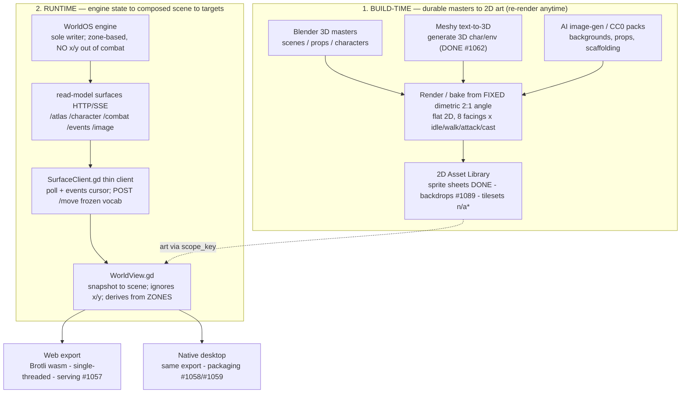
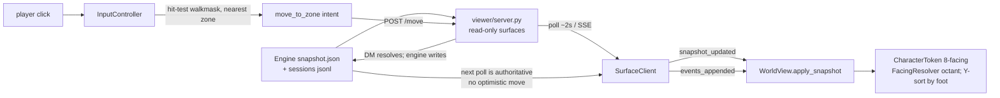
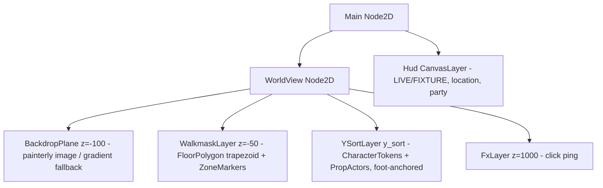

# GT2 Godot painterly-isometric renderer — QUARANTINED REFERENCE / KNOWLEDGE BASE

> **Quarantine note (2026-06-25):** this is historical/reference material for the Godot
> prototype, not the current GT2 renderer path or a required merge gate. Owner direction moved
> GT2 visual renderer work to the Unity 6 / Unity-MCP GPU-VM lane; #1165 owns the decision about
> archiving, moving, or converting `godot/` into an extension lane. Keep the engine-agnostic
> projection, SceneGrid, render-profile, and conformance lessons, but do not route new current
> renderer work here unless #1165 explicitly reopens that path.
>
> Built to make a cold agent productive without re-deriving the research. Companions:
> `ISO-PROJECTION.md` (locked projection), `tools/README.md` (asset pipeline),
> `docs/roadmap/contracts/render-profile.md` (the contract),
> `docs/roadmap/WORLDOS-GRAPHICS-ROADMAP.md` (where GT2 sits). Last updated 2026-06-25.

## Contents
1. [TL;DR](#tldr)
2. [Status — done vs open](#status)
3. [Architecture (diagrams)](#architecture)
4. [Knowledge base — what we learned (the gold)](#knowledge)
5. [How to run / validate](#run)
6. [Asset pipeline — Meshy → Blender → sprite sheet](#assets)
7. [Invariants (never violate)](#invariants)
8. [Gotchas & lessons (cost real time)](#gotchas)
9. [The full issue backlog](#backlog)
10. [References](#refs)
11. [File map](#files)

<a name="tldr"></a>
## 1. TL;DR

The **prototype foundation was done and CI-gated; the renderer is NOT current, feature-complete, or shipped.** A
vertical slice works: a directional character (real Meshy→Blender art) on **live engine state**,
**click-to-move** on the frozen `/move` vocab, correct **Y-sort occlusion** — validated locally
and in CI. The "looks-like-Pillars, fully-playable, shipped-to-web+native" end state is backlog
(see §2, §9), but that backlog is now reference material pending #1165. The architecture diagram
is the *historical plan*; ~half is built (§3 marks what's real).

The deepest thing to internalize: **the renderer is a stateless thin client over a zone-based
engine, and the sprite-sheet manifest + render-profile contract — not the pixels — is the durable
product.** Art swaps `CC0 → AI → Meshy/Blender` at the same `scope_key` with zero renderer change.
Proven this session (placeholder green-oval → a real rendered ranger, no code change).

> **Note:** Phaser 3 was the original GT2 MVP renderer; **retired 2026-06-21** (didn't deliver the
> painterly-iso look). Godot 4 then became the GT2 path, but **2026-06-25 owner direction
> quarantines Godot as reference/extension material** and moves current visual renderer work to
> Unity 6 / Unity-MCP. Decision record: `docs/roadmap/WORLDOS-GRAPHICS-ROADMAP.md` §4 and #1165.

<a name="status"></a>
## 2. Status — done vs open

**DONE (merged to main, CI-green):**

| # | What |
|---|---|
| #1051 | `renderer_profiles.godot` contract block + `ISO-PROJECTION.md` (dimetric 2:1 LOCKED) + a "no engine facing" conformance lock |
| #1052 | `godot/` project + `Config` + `SurfaceClient` thin-client transport + fixtures |
| #1053 | `WorldView` — backdrop plane + renderer-owned **procedural walkmask** + deterministic zone markers |
| #1054 | directional `CharacterToken` + sprite-sheet manifest v1 + CC0 placeholder art |
| #1055 | click-to-move (`move_to_zone`/`travel`/`inspect`) + `FacingResolver` + Y-sort occlusion |
| #1056 | `extensions/renderers/godot/ci/github-actions-godot.yml` — import + conformance + export(Web single-thread + Linux) + screenshot artifact |
| #1062 | Meshy→Blender asset pipeline (`tools/meshy_gen.py` + `bake_sprites.py` + `pack_sheet.py`) |

**OPEN (prioritized backlog) — detail in §9.**
Story/visual: **#1090** (narration+dialogue in-view — biggest gap) · **#1089** (painterly backdrop) ·
**#1063** (serve `_private` finals) · **#1092** (full party) · **#1060** (combat tokens) · **#1091**
(real rigged animation) · **#1093** (camera/audio/input). Delivery: **#1057/#1058/#1059**.
Tactics/hygiene: **#1061** (grid #461) · **#1064** (license gate).

<a name="architecture"></a>
## 3. Architecture

Two stages: a **build-time** pipeline that turns 3D/source masters into flat 2D art, and a
**runtime** thin client that composes engine state + that art into a scene exported to web + native.


\* No `TileMapLayer`/tileset: positioning is **zone-based**, so terrain is a procedural walkmask, not a tile grid (see §4.5).

**Runtime data flow** (each tick / on a click):



**Godot scene layer stack** (z-order; only YSortLayer is depth-sorted):



**Contract layering** (`docs/roadmap/contracts/render-profile.schema.json`):

```
render-profile
├── schema_version (v1)
├── core                      <- renderer-AGNOSTIC (every renderer honors)
│   ├── scene_kind            tilemap | backdrop
│   ├── positioning           theater | zone     (grid is future #461; NOT v1)
│   ├── locations[]           { engine_location_id (FK), art.scope_key, zones[] named NOT x,y }
│   ├── actors[]              { engine_actor_id (FK), art.scope_key }
│   └── ai_disclosure         { generated_by, model, date }
└── renderer_profiles         <- OPTIONAL; a renderer reads core + its OWN block
    ├── phaser                (the retired GT2 MVP path)
    ├── godot                 { projection dimetric2:1 | backdrop_layout(zone_anchors,walkmask) | actor_sheets | default_facing }
    └── rpgmaker              (reserved)
```

<a name="knowledge"></a>
## 4. Knowledge base — what we learned (the gold)

The research that shaped every decision (sources in §10). **Verified** = confirmed against a primary
source during the deep-research pass (run `wf_fdb69944-d4a`).

### 4.1 "Isometric" is almost always DIMETRIC 2:1 — and we locked it
- **Verified:** what games call "isometric" is technically **dimetric**: a 2:1 tile (width:height),
  edges at **~26.57°** (`atan(0.5)`) — SimCity 2000, Diablo II, the Infinity Engine. **True**
  isometric is 30°, equal foreshortening, ~1.732:1 tiles. Unity's default iso tilemap cell
  `(1, 0.5, 1)` is dimetric; true iso needs `Y = 0.57735` (`tan 30°`).
- **We locked DIMETRIC 2:1** (the classic-CRPG lineage) — in `ISO-PROJECTION.md`, asserted in every
  sprite manifest (`projection: "dimetric-2to1"`). **Irreversible once finals bake** (art + zone→screen
  geometry must share one projection), so it's decided FIRST.
- **Baking 3D→2D at 2:1:** ortho camera, **yaw 45°**, elevation tuned so a flat 1×1 floor tile's top
  face renders at a 2:1 bbox. `ratio = 1 / sin(elev)` → 2:1 at `elev = 30°`; `bake_sprites.py`
  calibrates empirically and lands ~**29.53°**.

### 4.2 How Pillars of Eternity / Tyranny actually did the painterly-iso look
A **hybrid 3D-render trick**, not hand-painting from scratch (Obsidian's *Update #79*, **verified**):
- **Backgrounds** were 3D-modeled and **pre-rendered out of Maya to flat 2D** (several GB raw, then
  compressed). Four passes — **final, depth, normal, albedo** — recombined in Unity for **per-pixel
  occlusion** of 3D objects and **real-time dynamic lighting**. The albedo pass was often hand-touched
  in Photoshop → **hybrid (3D-render + paintover)**.
- The illusion only resolves under an **orthographic camera at the "perfect angle"** — in-editor the
  world looks awkwardly skewed.
- **Pillars characters were NOT 2D sprites** — they were **real-time 3D skinned meshes** (normal/spec/
  albedo/tint + metal/cloth shaders) composited over the 2D backdrops, **snapped to 8 facings** (which
  gives the sprite-like look). Genuinely-2D-sprite characters belong to the **earlier Infinity Engine**
  games (Baldur's Gate 1/2, Planescape: Torment, Icewind Dale). Disco Elysium is the same family.

### 4.3 How OUR pipeline differs (and why)
- We **bake characters to 2D sprite sheets at build time** (Pillars rendered them real-time-3D). Why:
  the runtime stays **pure 2D** in Godot — cheaper, web-friendly, simpler. The 3D master (Blender/Meshy
  `.glb`) is the durable source; re-render at higher fidelity anytime.
- We use **Godot `Y-sort`** for depth (by the character's **foot point**), **NOT** Pillars' Unity
  per-pixel depth-pass occlusion (a 3D-over-2D technique). Do **not** port the depth-pass idea here.
- **AI can't make our characters.** Current AI sprite methods (*Sprite Sheet Diffusion*, arXiv
  2412.03685, Dec 2024 — **verified**) only do **single-facing** animation — no directional/multi-facing.
  So **AI is for backgrounds/props; Meshy (3D) is for characters** (render the 3D model from any angle).

### 4.4 Why Godot (over Babylon.js / Phaser)
- **Godot 4**: first-class **2D** (TileMap iso, built-in `Y-sort`), **one codebase exports to web
  (HTML5) and native** — the "both targets" requirement. **Babylon.js rejected** (3D engine).
  **Phaser** was the existing GT2 MVP; the owner chose Godot for the real-engine path and **retired the
  Phaser GT2 backdrop renderer**.
- **Godot web caveat (verified):** engine `.wasm` ~**40 MB uncompressed**, ~**5 MB Brotli**. Use the
  **single-threaded** web export (default since 4.3) to dodge `SharedArrayBuffer` / COOP+COEP headers.

### 4.5 The WorldOS engine's spatial reality — the load-bearing constraint
**No 2D coordinates out of combat.** Position is a single `current_location_id`; the world is
**abstract adjacency** (`Location.connections`). Spatial data exists **only in combat**: named **Zones**
(always; `Zone.adjacent`) + an **optional cell grid** (`Combat.grid_enabled`, #461). `Character` has no
`x/y`; only `Combatant` has optional `x/y`. Consequences (these explain the whole design):
- Renderer is **zone-based**: backdrop + **named-zone markers** + a **procedural walkmask**, NOT a tile
  grid. (Hence the diagram's "TileMapLayer" is actually a procedural floor.)
- **Facing is 100% renderer-derived** (no engine facing field — adding one breaks sole-writer): out of
  combat, 8-way snap of the zone→zone screen-vector on a `move_to_zone`; in combat, actor-zone →
  target-zone (Action-Replay envelope).
- **Any surface `x/y` is an ephemeral render-hint** (`positionAuthority:'derived'`), never authoritative.

### 4.6 The non-throwaway thesis (why scaffolding wasn't wasted)
The **sprite-sheet manifest + render-profile contract is the product, not the pixels.** Every source
emits the *same* manifest (rows = 8 facings, cols = 24 = idle4/walk8/attack6/cast6, foot anchor,
`projection`), so `CC0 → AI-paintover → Meshy/Blender final` is a **file-drop at the same `scope_key`
with zero renderer change**. Proven.

### 4.7 Licensing (decided)
- **Baldur's Gate 3 asset extraction is OUT** — ripped commercial assets can't enter the repo/build/
  release (fine to *study* BG3 for camera/feel). This is the question that started the effort.
- **Committed tree (`extensions/renderers/godot/assets/`) = CC0 / public-domain / WorldOS-original ONLY.** CC0 sources:
  Kenney, Quaternius, itch.io CC0 packs (e.g. Hormelz "8-Directional Knight").
- **Meshy / AI / Blender finals are owner-licensed but NOT CC0** → gitignored in
  `content/worlds/_private/.../images/<scope>/`, served at runtime, **never committed**. #1064 must add
  an "owner-generated (Meshy)" tier next to CC0.
- **AI-disclosure** (EU machine-readable, 2026-08-02; Steam survey) → record provenance in the
  render-profile `ai_disclosure` block for shipped AI content.

<a name="run"></a>
## 5. How to run / validate (optional historical/reference lane)
These commands are optional proof for changes under `extensions/renderers/godot/`; they are not the current GT2
renderer proof path and must not be made branch-protection-required during the Woodpecker
emergency recovery.

**Prerequisites** (install these first): **Godot 4.6.3** (godotengine.org → `/Applications/Godot.app`;
verify `godot --version`), **Blender 5.1.2** (`brew install blender`), and `uv`/Python (already required
by the engine). For the asset-pipeline API keys, see §6.

- Godot **4.6.3** at `/Applications/Godot.app/Contents/MacOS/Godot`; Blender **5.1.2** at `/opt/homebrew/bin/blender`.
- Parse/compile: `godot --headless --path extensions/renderers/godot --import`
- Logic smoke: `godot --headless --path extensions/renderers/godot --quit-after 180 -- --smoke-intent`
- Visual proof (real window): `godot --path extensions/renderers/godot --demo-occlusion --quit-after 300` → `/tmp/wos_godot_occlusion_{behind,front}.png`
- CI: `extensions/renderers/godot/ci/github-actions-godot.yml` runs all of the above + Web/Linux export on explicit archived-extension changes — deterministic, **no model keys**. It is a reference/extension lane only, not part of required Linux CI replacement.

<a name="assets"></a>
## 6. Asset pipeline — Meshy → Blender → sprite sheet
**Full toolkit: the `asset-gen` skill** (Meshy / Tripo3D / Scenario / PixelLab — job matrix, key
locations, the `tripo_gen.py`/`scenario_gen.py` wrappers, the wired `scenario`+`pixellab` MCPs).
Full bake detail in `tools/README.md`. In short:

**Keys & setup:** create accounts at meshy.ai / tripo3d.ai / scenario.com / pixellab.ai → copy each
API key from its dashboard → store in `~/.worldos/{meshy,tripo3d,scenario,pixellab}.key` (+
`scenario.secret`), `chmod 600` → verify with `python3 extensions/renderers/godot/tools/<svc>_gen.py --test-key`. Env
fallback `WORLDOS_*_API_KEY` (CI). Invoke the **`asset-gen` skill** for the full routing / job matrix.

```shell
python3 extensions/renderers/godot/tools/meshy_gen.py --prompt "..." --out <dir>            # Meshy text-to-3D (preview->refine PBR) -> model.glb
blender --background --python extensions/renderers/godot/tools/bake_sprites.py -- \
    --model <dir>/model.glb --out <dir>/frames                          # 8 facings x idle/walk/attack/cast at dimetric 2:1
python3 extensions/renderers/godot/tools/pack_sheet.py --frames <dir>/frames \
    --scope sprite-aubree-iso8 --out <dir>                              # tile -> 3072x1024 sheet.png + sheet.json (manifest v1)
```

- **Meshy API:** base `https://api.meshy.ai`, `POST /openapi/v2/text-to-3d` (`mode: preview` then `refine`,
  `pose_mode: t-pose`, `target_formats: ["glb"]`), Bearer auth, poll `GET .../:id` for `model_urls.glb`.
  ~10–20 credits/character. **Key:** `~/.worldos/meshy.key` (mode 600, OUTSIDE the repo) or `$MESHY_API_KEY`.
  ⚠ *The key was pasted into a chat transcript 2026-06-21 — rotate it.* (Webhooks + MCP servers exist —
  official `meshy-dev/meshy-mcp-server`, community `pasie15/meshy-ai-mcp-server` — not wired.)
- **Backgrounds & the Eva caveat:** the engine's `openclaw` image provider rides **Eva's OpenClaw
  gateway + Codex OAuth** — do **NOT** drive it autonomously (the "never touch Eva" invariant).
  **Now solved:** a `ScenarioImageProvider` is wired (`WORLDOS_IMAGE_PROVIDER=scenario`, direct API,
  non-Eva), and `scenario_gen.py` / the `scenario` MCP generate painterly backdrops with trained-model
  consistency (#1089). Rigged character animation (#1091) similarly via Tripo `rig`→`retarget`
  (`tripo_gen.py rig`). See the **`asset-gen` skill**.

<a name="invariants"></a>
## 7. Invariants (never violate)
- Engine = **sole writer**; the renderer is a **thin client** (owns zero state but the `/events` cursor).
- **Ignore all surface `x/y`**; re-derive every screen position from named **zones**.
- **No engine facing field, ever** — facing is renderer-derived (locked by a conformance assertion).
- Writes only the **frozen `/move` vocab**: `say/do/check/save/combat/attack/cast/use_item/clarify/travel/inspect/move_to_zone`.
- Projection is **irreversible once finals bake** — everything cites `ISO-PROJECTION.md` (dimetric 2:1).
- **Engine snapshot always overrides optimistic UI** — never move a token from the click; the next poll is authoritative.

<a name="gotchas"></a>
## 8. Gotchas & lessons (cost real time)
- **Worktree `_private` is gitignored → pruned on `git worktree remove`.** The first Meshy ranger was
  generated into a worktree's `_private` and **lost** on cleanup. Generate finals into the **canonical**
  repo's `_private`. The ranger now lives at `content/worlds/_private/baldurs-gate/images/sprite-aubree-iso8/`.
- **Dimetric calibration: measure a FLAT tile, not a solid cube** — a cube's side faces pollute the
  alpha bbox and drive elevation to the floor. Measure the top-face diamond of a 1×1 plane.
- **`export_presets.cfg` must pre-exist** (no CLI to add a preset). Validate locally without templates by
  checking the error is *"export template not found"* (preset OK) vs *"no preset named X"* (preset wrong).
  Committed presets are Web (single-threaded) + Linux; #1058 adds macOS.
- **GDScript coroutines must be awaited** — you can't "start all then await"; sequential `await` per surface is correct.
- **Multi-session repo.** Other agents share `/Users/lume/WorldOS`. Always work in a **worktree off
  `origin/main`**; never branch-flip the shared checkout. Merges can hit a transient "base branch was
  modified" race → retry.
- **Godot 4.4+ writes `.gd.uid` files** — commit them. Gitignore `.godot/`, `*.import`, export outputs.
- **After a merge batch**, refresh GitNexus once: `gitnexus analyze /Users/lume/WorldOS --name worldos --embeddings --index-only`.

<a name="backlog"></a>
## 9. The historical issue backlog (reference only until #1165 resolves)
**Story / visual (look + play like Pillars):**
- **#1090 — narration + dialogue in-view.** *Biggest gap:* the Godot view shows zero story text; prose
  only appears in the React dashboard. Wire `/events` + `/chat` into an in-view panel + a `say`/`clarify` affordance.
- **#1089 — painterly backdrop pipeline.** Meshy 3D env → Blender render-down → backdrop at the scene
  `scope_key` (backdrop is a procedural gradient today). Meshy→Blender, **not** Eva's image-gen.
- **#1063 — serve `_private` finals via `/sprite?scope=`.** Makes the Meshy character load in **real
  play** (today it only shows via a local screenshot/overwrite). Align the serving path with `/image`'s `_private/.../images/<scope>/`.
- **#1092 — full party + present NPCs** in exploration (only `party[0]` renders).
- **#1060 — combat & zone token rendering** via the Action-Replay envelope (whole roster; combat facing from actor→target zone).
- **#1091 — real *rigged* animation** (today's bake = *synthesized* bob/lunge, not skeletal; Meshy-rig or Mixamo).
- **#1093 — camera (pan/zoom/follow) + audio/ambience + input polish.**

**Delivery (export CI-validated; serving/packaging unbuilt):**
- **#1057 — serve the Godot HTML5 export at `/godot/*`** (single-threaded, Brotli) alongside `/openworlds`.
- **#1058 — standalone macOS `.app`** + `play.sh --client godot`.
- **#1059 — Mac app launches the Godot native client + a renderer Picker** (first-principles pass on native-vs-embedded first).

**Tactics / hygiene:**
- **#1061 — optional cell-grid (#461) tie-in** for gridded combat (branch:b; the one place surface `x/y` is authoritative).
- **#1064 — `license_check.py` gate** for committed `extensions/renderers/godot/assets` (add an "owner-generated/Meshy" tier next to CC0).

<a name="refs"></a>
## 10. References
- **Deep-research run** `wf_fdb69944-d4a` (engine choice, projection, Pillars pipeline, AI-sprite limits, asset sources — adversarially verified).
- **Design workflow** `wf_72bca9d5-451` (contract-gap analysis, Godot architecture, asset pipeline, packaging/CI, the drafted epic).
- Obsidian, *Pillars of Eternity Update #79 — Graphics & Rendering* (4-pass Maya pipeline; 8-facing 3D characters; ortho-at-the-perfect-angle).
- *Sprite Sheet Diffusion*, arXiv **2412.03685** (AI sprite animation = single-facing only).
- Godot docs: *Web export in 4.3* (~40 MB → ~5 MB Brotli `.wasm`; single-threaded default); `TileMapLayer`/`TileSet`; `render-profile.schema.json`.
- In-repo contracts: `docs/roadmap/contracts/{render-profile.md, render-profile.schema.json, move-intents.md, action-replay-envelope.md}`.
- CC0 sources: Kenney, Quaternius (Fantasy Props MegaKit), itch.io CC0 isometric packs (Hormelz 8-Directional Knight).

<a name="files"></a>
## 11. File map
- **Runtime:** `extensions/renderers/godot/project.godot` · `extensions/renderers/godot/autoload/{Config,SurfaceClient,ImageResolver,FacingResolver,RenderProfile}.gd` · `extensions/renderers/godot/scenes/{Main,WorldView,CharacterToken,PropActor,InputController,Hud,FxLayer}.{gd,tscn}`
- **Pipeline:** `extensions/renderers/godot/tools/{meshy_gen,bake_sprites,pack_sheet}.py` + `tools/README.md`
- **Contract/projection:** `extensions/renderers/godot/ISO-PROJECTION.md` · `docs/roadmap/contracts/*` · `docs/roadmap/WORLDOS-GRAPHICS-ROADMAP.md`
- **Art:** `extensions/renderers/godot/assets/characters/aubree/{sheet.png,sheet.json}` (CC0 placeholder) · `extensions/renderers/godot/assets/ATTRIBUTION.md` · finals in `content/worlds/_private/.../images/<scope>/` (gitignored)
- **Reference client we mirror:** `viewer/openworlds/render/surface-client.js`
- **Dev loop:** worktree off `origin/main` → additive change → local Godot validate → PR → squash-merge → prune.
